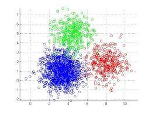

[![Contributors][contributors-shield]][contributors-url]
[![Forks][forks-shield]][forks-url]
[![Stargazers][stars-shield]][stars-url]
[![Issues][issues-shield]][issues-url]
[![MIT License][license-shield]][license-url]
[![LinkedIn][linkedin-shield]][linkedin-url]

<!-- PROJECT LOGO -->
 

  

  <h3 align="center">customer-segmentation</h3>

  

    Customer Segmentation Using K-Means Clustering Algorithm to help businesses understand their target audience.
     
    <a href="https://github.com/shie-ld/customer-segmentation/blob/main/docs/docs.md"><strong>Explore the docs »</strong></a>
     
     
    <a href="https://github.com/shie-ld/customer-segmentation/issues">Report Bug</a>
    ·
    <a href="https://github.com/shie-ld/customer-segmentation/issues">Request Feature</a>
  

<!-- TABLE OF CONTENTS -->
## Table of Contents

* [About the Project](#about-the-project)
* [Usage](#usage)
* [Documentation](#documentation)
* [Roadmap](#roadmap)
* [Contributing](#contributing)
* [License](#license)
* [Contact](#contact)

<!-- ABOUT THE PROJECT -->
## About The Project

Customer segmentation is important for businesses to understand their target audience. Different advertisements can be curated and sent to different audience segments based on their demographic profile, interests, and affluence level.

There are many unsupervised machine learning algorithms that can help companies identify their user base and create consumer segments.

In this project, we will be looking at a popular unsupervised learning technique called K-Means clustering. This algorithm can take in unlabelled customer data and assign each data point to clusters.

The goal of K-Means is to group all the data available into non-overlapping sub-groups that are distinct from each other.

That means each sub-group/cluster will consist of features that distinguish them from other clusters.

<!-- USAGE EXAMPLES -->
## Usage

Just run [this](https://colab.research.google.com/drive/1x2Vkg2Dz9le44DBlKlxk19ykL8mQ21PL?usp=sharing) Jupyter Notebook hosted on Google Colab to see how the project is working. Else you can download Anaconda distribution on your system (Jupyter Notebook comes with it builtin) and run the notebook locally and you are good to go.

<!-- DOCUMENTATION -->
## Documentation

Read the [docs](./docs/docs.md).

<!-- ROADMAP -->
## Roadmap

See the [open issues](https://github.com/shie-ld/customer-segmentation/issues) for a list of proposed features (and known issues).

<!-- CONTRIBUTING -->
## Contributing

Contributions are what make the open source community such an amazing place to be learn, inspire, and create. Any contributions you make are **greatly appreciated**.

1. Fork the Project
2. Create your Feature Branch (`git checkout -b feature/AmazingFeature`)
3. Commit your Changes (`git commit -m 'Add some AmazingFeature'`)
4. Push to the Branch (`git push origin feature/AmazingFeature`)
5. Open a Pull Request

<!-- LICENSE -->
## License

Distributed under the MIT License. See `LICENSE` for more information.

<!-- CONTACT -->
## Contact

Rudresh Dixit - dixitrdreshoffcial@gmail.com

<!-- MARKDOWN LINKS & IMAGES -->
<!-- https://www.markdownguide.org/basic-syntax/#reference-style-links -->
[contributors-shield]: https://img.shields.io/github/contributors/shie-ld/customer-segmentation.svg?style=flat-square
[contributors-url]: https://github.com/shie-ld/customer-segmentation/graphs/contributors
[forks-shield]: https://img.shields.io/github/forks/shie-ld/customer-segmentation.svg?style=flat-square
[forks-url]: https://github.com/shie-ld/customer-segmentation/network/members
[stars-shield]: https://img.shields.io/github/stars/shie-ld/customer-segmentation.svg?style=flat-square
[stars-url]: https://github.com/shie-ld/customer-segmentation/stargazers
[issues-shield]: https://img.shields.io/github/issues/shie-ld/customer-segmentation.svg?style=flat-square
[issues-url]: https://github.com/shie-ld/customer-segmentation/issues
[license-shield]: https://img.shields.io/github/license/shie-ld/customer-segmentation.svg?style=flat-square
[license-url]: https://github.com/shie-ld/customer-segmentation/blob/master/LICENSE.txt
[linkedin-shield]: https://img.shields.io/badge/-LinkedIn-black.svg?style=flat-square&logo=linkedin&colorB=555
[linkedin-url]: https://linkedin.com/in/rudresh-dixit-11a15618a/

