## Table of Contents:

* [Imports and Reading the DataFrame](#imports-and-reading-the-dataframe)
* [Standardizing Variables](#standardizing-variables)
* [One Hot Encoding](#one-hot-encoding)
* [Building the Clustering Model](#building-the-clustering-model)
* [Silhouette Coefficient](#silhouette-coefficient)
* [Building Clustering Model 2](#building-clustering-model-2)
* [Model 1 vs Model 2](#model-1-vs-model-2)
* [Cluster Analysis](#cluster-analysis)
* [Spending Score vs Annual Income vs Age](#spending-score-vs-annual-income-vs-age)
* [Gender Breakdown](#gender-breakdown)
* [Main attributes of each segment](#main-attributes-of-each-segment)
* [Building personas around each cluster](#building-personas-around-each-cluster)


## Imports and Reading the DataFrame

Run the following lines of code to import the necessary libraries and read the dataset:

```
# Imports
import pandas as pd
import numpy as np
import matplotlib.pyplot as plt
import sea
from kneed import KneeLocator

from sklearn.datasets import make_blobs
from sklearn.cluster import KMeans
from sklearn.metrics import silhouette_score
from sklearn.preprocessing import StandardScaler
from sklearn.decomposition import PCA

from mpl_toolkits.mplot3d import Axes3D


# reading the data frame
df = pd.read_csv('https://raw.githubusercontent.com/shie-ld/datasets/main/Mall_Customers.csv')
```

Now, lets take a look at the head of the data frame:

```
df.head()
```

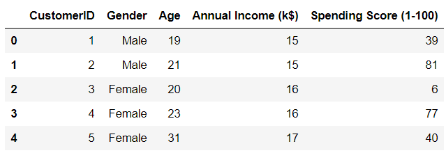

There are five variables in the dataset. `CustomerID` is the unique identifier of each customer in the dataset, and we can drop this variable. It doesn’t provide us with any useful cluster information.

Since gender is a categorial variable, it needs to be encoded and converted into numeric.

All other variables will be scaled to follow a normal distribution before being fed into the model. We will `standardize` these variables with a mean of `0` and a standard deviation of `1`.


## Standardizing Variables

First, lets standardize all variables in the dataset to get them around the same scale.

```
col_names = ['Annual Income (k$)', 'Age', 'Spending Score (1-100)']
features = df[col_names]
scaler = StandardScaler().fit(features.values)
features = scaler.transform(features.values)
scaled_features = pd.DataFrame(features, columns = col_names)
scaled_features.head()
```

Now, lets take a look at the head of the data frame:

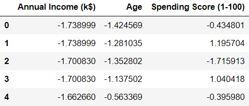

We can see that all the variables have been transformed, and are now centered around zero.


## One Hot Encoding

The variable `gender` is categorical, and we need to transform this into a numeric variable.

This means that we need to substitute numbers for each category. We can do this with Pandas using `pd.get_dummies()`.

```
gender = df['Gender']
newdf = scaled_features.join(gender)

newdf = pd.get_dummies(newdf, prefix=None, prefix_sep='_', dummy_na=False, columns=None, sparse=False, drop_first=False, dtype=None)

newdf = newdf.drop(['Gender_Male'],axis=1)

newdf.head()
```

Lets take a look at the head of the data frame again:

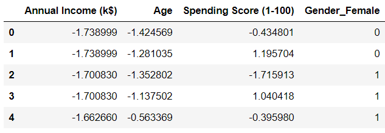

We can see that the gender variable has been transformed. You might have noticed that we dropped `Gender_Male` from the data frame. This is because there is no need to keep the variable anymore.

The values for `Gender_Male` can be inferred from `Gender_Female,` (that is, if `Gender_Female` is `0`, then `Gender_Male` will be `1` and vice versa).


## Building the Clustering Model

Lets build a K-means clustering model and fit it on all the variables in the dataset.

Then, we will visualize the performance of the clustering model in an `elbow plot`.

The `elbow plot` will tell us tell us the ideal number of clusters to use when building our model.

```
SSE = []

for cluster in range(1,10):
    kmeans = KMeans(n_jobs = -1, n_clusters = cluster, init='k-means++')
    kmeans.fit(newdf)
    SSE.append(kmeans.inertia_)

# converting the results into a dataframe and plotting them

frame = pd.DataFrame({'Cluster':range(1,10), 'SSE':SSE})
plt.figure(figsize=(12,6))
plt.plot(frame['Cluster'], frame['SSE'], marker='o')
plt.xlabel('Number of clusters')
plt.ylabel('Inertia')
```

Visualizing the model’s performance:

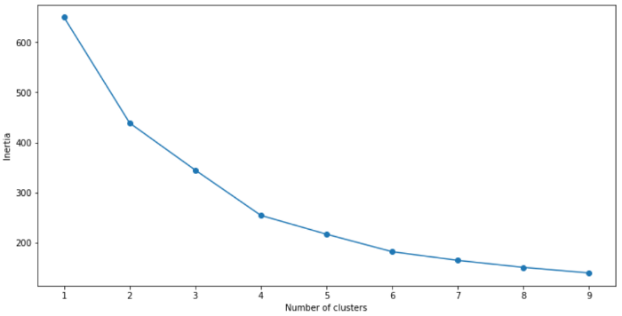

Based on the elbow plot above, we can see that the optimal number of clusters is 4.

Now, lets take a look at another clustering metric.


## Silhouette Coefficient

A `silhouette coefficient`, or a `silhouette score` is a metric used to evaluate the quality of clusters created by the algorithm.

Silhouette scores range from `-1` to `+1`. The higher the silhouette score, the better the model.

The silhouette score measures the distance between all the data points within the same cluster. The lower this distance, the better the silhouette score.

It also measures the distance between an object and the data points in the nearest cluster. The higher this distance, the better.

A silhouette score closer to `+1` indicates good clustering performance, and a silhouette score closer to `-1` indicates a poor clustering model.

Lets calculate the silhouette score of the model we just built:

```
# First, build a model with 4 clusters

kmeans = KMeans(n_jobs = -1, n_clusters = 4, init='k-means++')
kmeans.fit(newdf)

# Now, print the silhouette score of this model

print(silhouette_score(newdf, kmeans.labels_, metric='euclidean'))
```

The silhouette score of this model is about `0.35`.

This isn’t a bad model, but we can do better and try getting higher cluster separation.

Before we try doing that, lets visualize the clusters we just built to get an idea of how well the model is doing:

```
clusters = kmeans.fit_predict(df.iloc[:,1:])
newdf["label"] = clusters
 
fig = plt.figure(figsize=(21,10))
ax = fig.add_subplot(111, projection='3d')
ax.scatter(newdf.Age[newdf.label == 0], newdf["Annual Income (k$)"][newdf.label == 0], df["Spending Score (1-100)"][newdf.label == 0], c='blue', s=60)

ax.scatter(newdf.Age[df.label == 1], newdf["Annual Income (k$)"][newdf.label == 1], newdf["Spending Score (1-100)"][newdf.label == 1], c='red', s=60)
ax.scatter(newdf.Age[df.label == 2], newdf["Annual Income (k$)"][newdf.label == 2], df["Spending Score (1-100)"][newdf.label == 2], c='green', s=60)
ax.scatter(newdf.Age[newdf.label == 3], newdf["Annual Income (k$)"][newdf.label == 3], newdf["Spending Score (1-100)"][newdf.label == 3], c='orange', s=60)

ax.view_init(30, 185)
plt.show()
```

The output of the above code is as follows:

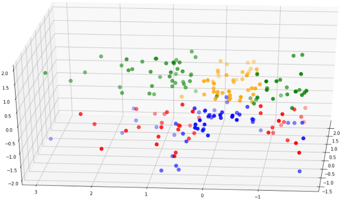


From the above diagram, we can see that cluster separation isn’t too great.

The red points are mixed with the blue, and the green are overlapping the yellow.

This, along with the silhouette score shows us that the model isn’t performing too well.

Now, lets create a new model that has better cluster separability than this one.


## Building Clustering Model 2

For this model, lets do some feature selection.

We can use a technique called `Principal Component Analysis (PCA)`.

PCA is a technique that helps us reduce the dimension of a dataset. When we run PCA on a data frame, new components are created. These components explain the maximum variance in the model.

We can select a subset of these variables and include them into the K-means model.

Now, lets run `PCA` on the dataset:

```
pca = PCA(n_components=4)
principalComponents = pca.fit_transform(newdf)

features = range(pca.n_components_)
plt.bar(features, pca.explained_variance_ratio_, color='black')
plt.xlabel('PCA features')
plt.ylabel('variance %')
plt.xticks(features)

PCA_components = pd.DataFrame(principalComponents)
```

The above code will render the following chart:

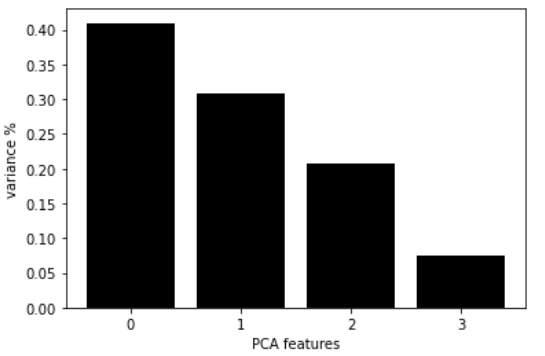

This chart shows us each PCA component, along with it variance.

Based on this visualization, we can see that the first two PCA components explain around `70%` of the dataset variance.

We can feed these two components into the model.

Lets build the model again with the first two principal components, and decide on the number of clusters to use:

```
ks = range(1, 10)
inertias = []

for k in ks:
    model = KMeans(n_clusters=k)
    model.fit(PCA_components.iloc[:,:2])
    inertias.append(model.inertia_)

plt.plot(ks, inertias, '-o', color='black')
plt.xlabel('number of clusters, k')
plt.ylabel('inertia')
plt.xticks(ks)
plt.show()
```

The code above will render the following chart:

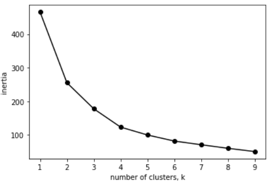

Again, it looks like the optimal number of clusters is `4`.

We can calculate the silhouette score for this model with `4` clusters:

```
model = KMeans(n_clusters=4)
model.fit(PCA_components.iloc[:,:2])

# silhouette score
print(silhouette_score(PCA_components.iloc[:,:2], model.labels_, metric='euclidean'))
```

The silhouette score of this model is `0.42`, which is better than the previous model we created.

We can visualize the clusters for this model just like we did earlier:

```
model = KMeans(n_clusters=4)

clusters = model.fit_predict(PCA_components.iloc[:,:2])
newdf["label"] = clusters
 
fig = plt.figure(figsize=(21,10))
ax = fig.add_subplot(111, projection='3d')
ax.scatter(newdf.Age[newdf.label == 0], newdf["Annual Income (k$)"][newdf.label == 0], newdf["Spending Score (1-100)"][newdf.label == 0], c='blue', s=60)
ax.scatter(newdf.Age[newdf.label == 1], newdf["Annual Income (k$)"][newdf.label == 1], newdf["Spending Score (1-100)"][newdf.label == 1], c='red', s=60)
ax.scatter(newdf.Age[newdf.label == 2], newdf["Annual Income (k$)"][newdf.label == 2], newdf["Spending Score (1-100)"][newdf.label == 2], c='green', s=60)

ax.scatter(newdf.Age[newdf.label == 3], newdf["Annual Income (k$)"][newdf.label == 3], newdf["Spending Score (1-100)"][newdf.label == 3], c='orange', s=60)

ax.view_init(30, 185)
plt.show()
```

## Model 1 vs Model 2

Lets compare the cluster separability of this model to that of the first model:

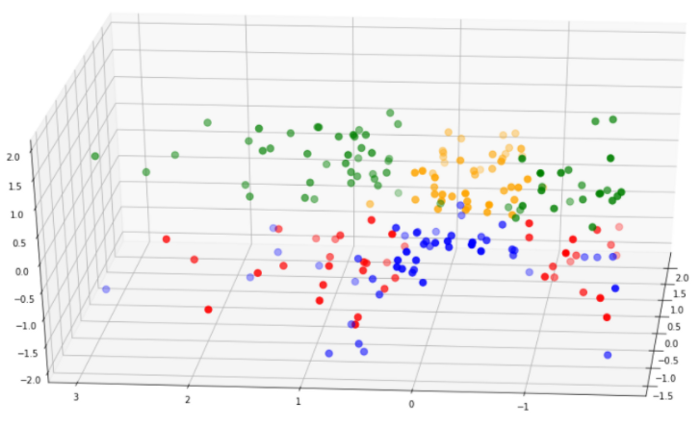

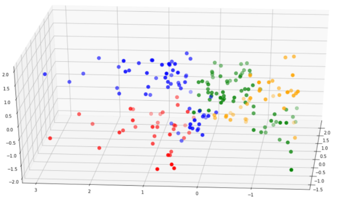

Notice that the clusters in the second model are much better separated than that in the first model.

Furthermore, the silhouette score of the second model is a lot higher.

For these reasons, we can pick the second model to go forward with our analysis.


## Cluster Analysis

Now that we’re done building these different clusters, lets try to interpret them and look at the different customer segments.

First, lets map the clusters back to the dataset and take a look at the head of the data frame.

```
df = pd.read_csv('Mall_Customers.csv')
df = df.drop(['CustomerID'],axis=1)

# map back clusters to dataframe

pred = model.predict(PCA_components.iloc[:,:2])
frame = pd.DataFrame(df)
frame['cluster'] = pred
frame.head()
```


Notice that each row in the data frame is now assigned to a cluster.

To compare attributes of the different clusters, lets find the average of all variables across each cluster:

```
avg_df = df.groupby(['cluster'], as_index=False).mean()
avg_df.show()
```

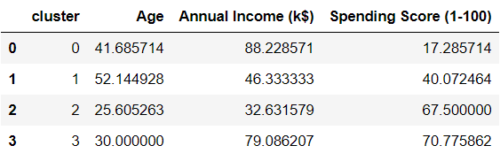

We can interpret these clusters more easily if we visualized them. Run these four lines of code to come up with different visualizations of each variable:

```
sns.barplot(x='cluster',y='Age',data=avg_df)
sns.barplot(x='cluster',y='Spending Score (1-100)',data=avg_df)
sns.barplot(x='cluster',y='Annual Income (k$)',data=avg_df)
```

## Spending Score vs Annual Income vs Age

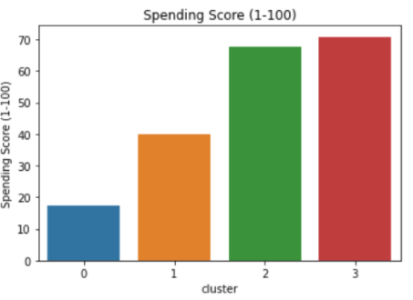
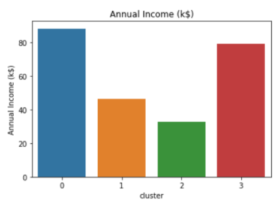
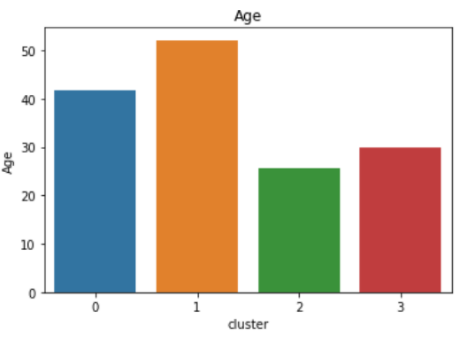


## Gender Breakdown


```
df2 = pd.DataFrame(df.groupby(['cluster','Gender'])['Gender'].count())
df2.head()
```
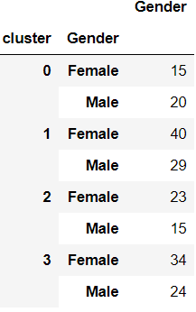


## Main attributes of each segment

### Cluster 0:

    * High average annual income, low spending.
    * Mean age is around 40 and gender is predominantly male.

### Cluster 1:

    * Low to mid average income, average spending capacity.
    * Mean age is around 50 and gender is predominantly female.

### Cluster 2:

    * Low average income, high spending score.
    * Mean age is around 25 and gender is predominantly female.

### Cluster 3:

    * High average income, high spending score.
    * Mean age is around 30 and gender is predominantly female.

It is important to note that calculating the median age would provide better insight on the distribution of age within each cluster.

Also, females are more highly represented in the entire dataset, which is why most clusters contain a larger number of females than males. We can find the percentage of each gender relative to the numbers in the entire dataset to give us a better idea of gender distribution.


## Building personas around each cluster

Now that we know the attributes of each cluster, we can build personas around them.

Being able to tell a story around your analysis is an important skill to have as a data scientist.

This will help your clients or stakeholders understand your findings more easily.

### Cluster 0: The frugal spender

* This persona comprises of middle aged individuals who are very careful with money.

* Despite having the highest average income compared to individuals in all other clusters, they spend the least.

* This might be because they have financial responsibilities — like saving up for their kid’s higher education.

* Recommendation: Promos, coupons, and discount codes will attract individuals in this segment due to their tendency to spend less

### Cluster 1: Almost retired

* This segment comprises of an older group of people.

* They earn less and spend less, and are probably saving up for retirement.

* Recommendation: Marketing to these individuals can be done through Facebook, which appeals to an older demographic. Promote healthcare related products to people in this segment.

### Cluster 2: The careless buyer

* This segment is made up of a younger age group.

* Individuals in this segment are most likely first jobbers. They make the least amount of money compared to all other segments.

* However, they are very high spenders.

* These are enthusiastic young individuals who enjoy living a good lifestyle, and tend to spend above their means.

* Recommendation: Since these are young individuals who spend a lot, providing them with travel coupons or hotel discounts might be a good idea. Providing them with discounts off top clothing and makeup brands would also work well for this segment.


### Cluster 3: Highly affluent individuals

* These are individuals who have worked hard to build up a significant amount of wealth.

* They also spend large amounts of money to live a good lifestyle.

* These individuals have likely just started a family, and are leading baby or family-focused lifestyles. It is a good idea to promote baby or child related products to these individuals.

* Recommendation: Due to their large spending capacity and their demographic, these individuals are likely to be looking for properties to buy or invest in. They are also more likely than all other segments to take out housing loans and make serious financial commitments.


